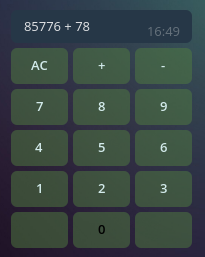

# Calcbot
https://t.me/SimpleCalcPadBot



Simple calc bot for telegram.

## Running locally

Copy .env.example to .env, change values as you need.
Add dotenv to project (i use docker, so it's not in Gemfile), then
```sh
rake telegram:register_webhook
rails s
```
Keep in mind: you need **https** domain to receive webhook updates
from telegram servers
